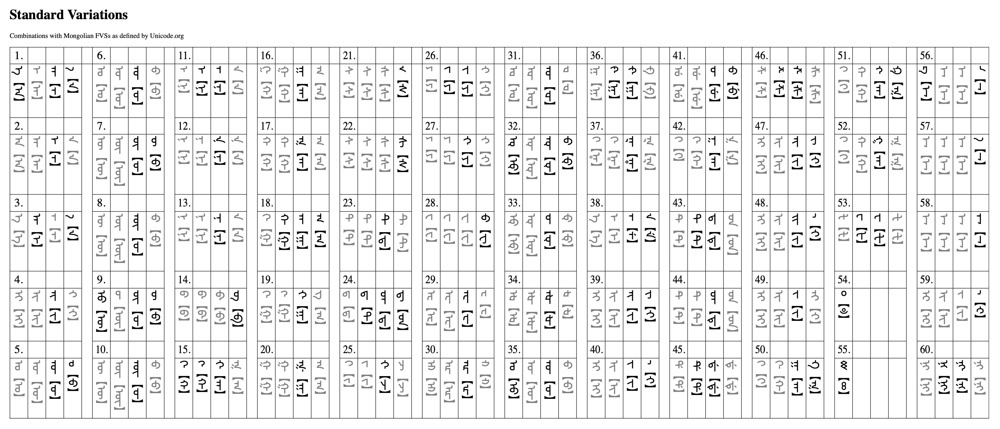

# Mongolian (Manchu) Unicode Block

- [Mongolian Block Specification](./Unicode-v15-ch13-Mongolian.pdf), taken [here](https://www.unicode.org/charts/PDF/U1800.pdf), from Unicode.org (Unicode v15).
- [Usage Specification](./Unicode-v15-ch13-Mongolian.pdf) of the Mongolian Unicode Standard, compiled from [this documentation](https://www.unicode.org/versions/Unicode15.0.0/ch13.pdf#G27882), from Unicode.org (Unicode v15).

## Standard Variations for Mongolian Script

The following data was taken from Unicode.org's [StandardVariants.txt](https://unicode.org/Public/UNIDATA/StandardizedVariants.txt) on May 3, 2023. Refer the Mongolian Unicode Standard for an explanation and more information.

```text
# Mongolian

1820 180B; second form; isolate medial final # MONGOLIAN LETTER A
1820 180C; third form; medial # MONGOLIAN LETTER A
1821 180B; second form; initial final # MONGOLIAN LETTER E
1822 180B; second form; medial # MONGOLIAN LETTER I
1823 180B; second form; medial final # MONGOLIAN LETTER O
1824 180B; second form; medial # MONGOLIAN LETTER U
1825 180B; second form; medial final # MONGOLIAN LETTER OE
1825 180C; third form; medial # MONGOLIAN LETTER OE
1826 180B; second form; isolate medial final # MONGOLIAN LETTER UE
1826 180C; third form; medial # MONGOLIAN LETTER UE
1828 180B; second form; initial medial # MONGOLIAN LETTER NA
1828 180C; third form; medial # MONGOLIAN LETTER NA
1828 180D; fourth form; medial # MONGOLIAN LETTER NA
182A 180B; second form; final # MONGOLIAN LETTER BA
182C 180B; second form; isolate initial medial # MONGOLIAN LETTER QA
182C 180C; third form; medial # MONGOLIAN LETTER QA
182C 180D; fourth form; medial # MONGOLIAN LETTER QA
182D 180B; second form; initial medial final # MONGOLIAN LETTER GA
182D 180C; third form; medial # MONGOLIAN LETTER GA
182D 180D; fourth form; medial # MONGOLIAN LETTER GA
1830 180B; second form; final # MONGOLIAN LETTER SA
1830 180C; third form; final # MONGOLIAN LETTER SA
1832 180B; second form; medial # MONGOLIAN LETTER TA
1833 180B; second form; initial medial final # MONGOLIAN LETTER DA
1835 180B; second form; medial # MONGOLIAN LETTER JA
1836 180B; second form; initial medial # MONGOLIAN LETTER YA
1836 180C; third form; medial # MONGOLIAN LETTER YA
1838 180B; second form; final # MONGOLIAN LETTER WA
1844 180B; second form; medial # MONGOLIAN LETTER TODO E
1845 180B; second form; medial # MONGOLIAN LETTER TODO I
1846 180B; second form; medial # MONGOLIAN LETTER TODO O
1847 180B; second form; isolate medial final # MONGOLIAN LETTER TODO U
1847 180C; third form; medial # MONGOLIAN LETTER TODO U
1848 180B; second form; medial # MONGOLIAN LETTER TODO OE
1849 180B; second form; isolate medial # MONGOLIAN LETTER TODO UE
184D 180B; second form; initial medial # MONGOLIAN LETTER TODO QA
184E 180B; second form; medial # MONGOLIAN LETTER TODO GA
185D 180B; second form; medial final # MONGOLIAN LETTER SIBE E
185E 180B; second form; medial final # MONGOLIAN LETTER SIBE I
185E 180C; third form; medial final # MONGOLIAN LETTER SIBE I
1860 180B; second form; medial final # MONGOLIAN LETTER SIBE UE
1863 180B; second form; medial # MONGOLIAN LETTER SIBE KA
1868 180B; second form; initial medial # MONGOLIAN LETTER SIBE TA
1868 180C; third form; medial # MONGOLIAN LETTER SIBE TA
1869 180B; second form; initial medial # MONGOLIAN LETTER SIBE DA
186F 180B; second form; initial medial # MONGOLIAN LETTER SIBE ZA
1873 180B; second form; medial final # MONGOLIAN LETTER MANCHU I
1873 180C; third form; medial final # MONGOLIAN LETTER MANCHU I
1873 180D; fourth form; medial # MONGOLIAN LETTER MANCHU I
1874 180B; second form; medial final # MONGOLIAN LETTER MANCHU KA
1874 180C; third form; medial final # MONGOLIAN LETTER MANCHU KA
1874 180D; fourth form; medial # MONGOLIAN LETTER MANCHU KA
1876 180B; second form; initial medial # MONGOLIAN LETTER MANCHU FA
1880 180B; second form; # MONGOLIAN LETTER ALI GALI ANUSVARA ONE
1881 180B; second form; # MONGOLIAN LETTER ALI GALI VISARGA ONE
1887 180B; second form; isolate final # MONGOLIAN LETTER ALI GALI A
1887 180C; third form; final # MONGOLIAN LETTER ALI GALI A
1887 180D; fourth form; final # MONGOLIAN LETTER ALI GALI A
1888 180B; second form; final # MONGOLIAN LETTER ALI GALI I
188A 180B; second form; initial medial # MONGOLIAN LETTER ALI GALI NGA
```

Here it is organized:

### Special Characters

| Unicode | Abbreviation |               Name                |
| :-----: | :----------: | :-------------------------------: |
|  180B   |     FVS1     | Mongolian Free Variant Selector 1 |
|  180C   |     FVS2     | Mongolian Free Variant Selector 2 |
|  180D   |     FVS3     | Mongolian Free Variant Selector 3 |
|  180F   |     FVS4     | Mongolian Free Variant Selector 4 |
|  180E   |     MVS      |     Mongolian Vowel Separator     |
|  200C   |     ZWNJ     |       Zero Width Non-Joiner       |
|  200D   |     ZWJ      |         Zero Width Joiner         |
|  202F   |    NNBSP     |       Narrow No-Break Space       |

- Mongolian Vowel Separator (MVS) is _not_ relevant to the Manchu script.
- ZWJ can be used to artificially control the positional form of characters.
- In Manchu, NNBSP is used to connect words to their separated suffixes to avoid line breaks, and is necessary for the genitive marker `-i`.

### Standard Variations

| No. | Glyphs |  Unicode  | Sp. Char. |   Form №    |   Applicable Positions   |                  Name                  |
| :-: | :----: | :-------: | :-------: | :---------: | :----------------------: | :------------------------------------: |
|  1  |  `ᠠ᠋`  | 1820 180B |   FSV1    | second form |  isolate, medial, final  |           MONGOLIAN LETTER A           |
|  2  |  `ᠠ᠌`  | 1820 180C |   FSV2    | third form  |          medial          |           MONGOLIAN LETTER A           |
|  3  |  `ᠡ᠋`  | 1821 180B |   FSV1    | second form |      initial, final      |           MONGOLIAN LETTER E           |
|  4  |  `ᠢ᠋`  | 1822 180B |   FSV1    | second form |          medial          |           MONGOLIAN LETTER I           |
|  5  |  `ᠣ᠋`  | 1823 180B |   FSV1    | second form |      medial, final       |           MONGOLIAN LETTER O           |
|  6  |  `ᠤ᠋`  | 1824 180B |   FSV1    | second form |          medial          |           MONGOLIAN LETTER U           |
|  7  |  `ᠥ᠋`  | 1825 180B |   FSV1    | second form |      medial, final       |          MONGOLIAN LETTER OE           |
|  8  |  `ᠥ᠌`  | 1825 180C |   FSV2    | third form  |          medial          |          MONGOLIAN LETTER OE           |
|  9  |  `ᠦ᠋`  | 1826 180B |   FSV1    | second form |  isolate, medial, final  |          MONGOLIAN LETTER UE           |
| 10  |  `ᠦ᠌`  | 1826 180C |   FSV2    | third form  |          medial          |          MONGOLIAN LETTER UE           |
| 11  |  `ᠨ᠋`  | 1828 180B |   FSV1    | second form |     initial, medial      |          MONGOLIAN LETTER NA           |
| 12  |  `ᠨ᠌`  | 1828 180C |   FSV2    | third form  |          medial          |          MONGOLIAN LETTER NA           |
| 13  |  `ᠨ᠍`  | 1828 180D |   FSV3    | fourth form |          medial          |          MONGOLIAN LETTER NA           |
| 14  |  `ᠪ᠋`  | 182A 180B |   FSV1    | second form |          final           |          MONGOLIAN LETTER BA           |
| 15  |  `ᠬ᠋`  | 182C 180B |   FSV1    | second form | isolate, initial, medial |          MONGOLIAN LETTER QA           |
| 16  |  `ᠬ᠌`  | 182C 180C |   FSV2    | third form  |          medial          |          MONGOLIAN LETTER QA           |
| 17  |  `ᠬ᠍`  | 182C 180D |   FSV3    | fourth form |          medial          |          MONGOLIAN LETTER QA           |
| 18  |  `ᠭ᠋`  | 182D 180B |   FSV1    | second form |  initial, medial, final  |          MONGOLIAN LETTER GA           |
| 19  |  `ᠭ᠌`  | 182D 180C |   FSV2    | third form  |          medial          |          MONGOLIAN LETTER GA           |
| 20  |  `ᠭ᠍`  | 182D 180D |   FSV3    | fourth form |          medial          |          MONGOLIAN LETTER GA           |
| 21  |  `ᠰ᠋`  | 1830 180B |   FSV1    | second form |          final           |          MONGOLIAN LETTER SA           |
| 22  |  `ᠰ᠌`  | 1830 180C |   FSV2    | third form  |          final           |          MONGOLIAN LETTER SA           |
| 23  |  `ᠲ᠋`  | 1832 180B |   FSV1    | second form |          medial          |          MONGOLIAN LETTER TA           |
| 24  |  `ᠳ᠋`  | 1833 180B |   FSV1    | second form |  initial, medial, final  |          MONGOLIAN LETTER DA           |
| 25  |  `ᠵ᠋`  | 1835 180B |   FSV1    | second form |          medial          |          MONGOLIAN LETTER JA           |
| 26  |  `ᠶ᠋`  | 1836 180B |   FSV1    | second form |     initial, medial      |          MONGOLIAN LETTER YA           |
| 27  |  `ᠶ᠌`  | 1836 180C |   FSV2    | third form  |          medial          |          MONGOLIAN LETTER YA           |
| 28  |  `ᠸ᠋`  | 1838 180B |   FSV1    | second form |          final           |          MONGOLIAN LETTER WA           |
| 29  |  `ᡄ᠋`  | 1844 180B |   FSV1    | second form |          medial          |        MONGOLIAN LETTER TODO E         |
| 30  |  `ᡅ᠋`  | 1845 180B |   FSV1    | second form |          medial          |        MONGOLIAN LETTER TODO I         |
| 31  |  `ᡆ᠋`  | 1846 180B |   FSV1    | second form |          medial          |        MONGOLIAN LETTER TODO O         |
| 32  |  `ᡇ᠋`  | 1847 180B |   FSV1    | second form |  isolate, medial, final  |        MONGOLIAN LETTER TODO U         |
| 33  |  `ᡇ᠌`  | 1847 180C |   FSV2    | third form  |          medial          |        MONGOLIAN LETTER TODO U         |
| 34  |  `ᡈ᠋`  | 1848 180B |   FSV1    | second form |          medial          |        MONGOLIAN LETTER TODO OE        |
| 35  |  `ᡉ᠋`  | 1849 180B |   FSV1    | second form |     isolate, medial      |        MONGOLIAN LETTER TODO UE        |
| 36  |  `ᡍ᠋`  | 184D 180B |   FSV1    | second form |     initial, medial      |        MONGOLIAN LETTER TODO QA        |
| 37  |  `ᡎ᠋`  | 184E 180B |   FSV1    | second form |          medial          |        MONGOLIAN LETTER TODO GA        |
| 38  |  `ᡝ᠋`  | 185D 180B |   FSV1    | second form |      medial, final       |        MONGOLIAN LETTER SIBE E         |
| 39  |  `ᡞ᠋`  | 185E 180B |   FSV1    | second form |      medial, final       |        MONGOLIAN LETTER SIBE I         |
| 40  |  `ᡞ᠌`  | 185E 180C |   FSV2    | third form  |      medial, final       |        MONGOLIAN LETTER SIBE I         |
| 41  |  `ᡠ᠋`  | 1860 180B |   FSV1    | second form |      medial, final       |        MONGOLIAN LETTER SIBE UE        |
| 42  |  `ᡣ᠋`  | 1863 180B |   FSV1    | second form |          medial          |        MONGOLIAN LETTER SIBE KA        |
| 43  |  `ᡨ᠋`  | 1868 180B |   FSV1    | second form |     initial, medial      |        MONGOLIAN LETTER SIBE TA        |
| 44  |  `ᡨ᠌`  | 1868 180C |   FSV2    | third form  |          medial          |        MONGOLIAN LETTER SIBE TA        |
| 45  |  `ᡩ᠋`  | 1869 180B |   FSV1    | second form |     initial, medial      |        MONGOLIAN LETTER SIBE DA        |
| 46  |  `ᡯ᠋`  | 186F 180B |   FSV1    | second form |     initial, medial      |        MONGOLIAN LETTER SIBE ZA        |
| 47  |  `ᡳ᠋`  | 1873 180B |   FSV1    | second form |      medial, final       |       MONGOLIAN LETTER MANCHU I        |
| 48  |  `ᡳ᠌`  | 1873 180C |   FSV2    | third form  |      medial, final       |       MONGOLIAN LETTER MANCHU I        |
| 49  |  `ᡳ᠍`  | 1873 180D |   FSV3    | fourth form |          medial          |       MONGOLIAN LETTER MANCHU I        |
| 50  |  `ᡴ᠋`  | 1874 180B |   FSV1    | second form |      medial, final       |       MONGOLIAN LETTER MANCHU KA       |
| 51  |  `ᡴ᠌`  | 1874 180C |   FSV2    | third form  |      medial, final       |       MONGOLIAN LETTER MANCHU KA       |
| 52  |  `ᡴ᠍`  | 1874 180D |   FSV3    | fourth form |          medial          |       MONGOLIAN LETTER MANCHU KA       |
| 53  |  `ᡶ᠋`  | 1876 180B |   FSV1    | second form |     initial, medial      |       MONGOLIAN LETTER MANCHU FA       |
| 54  |  `ᢀ᠋`  | 1880 180B |   FSV1    | second form |                          | MONGOLIAN LETTER ALI GALI ANUSVARA ONE |
| 55  |  `ᢁ᠋`  | 1881 180B |   FSV1    | second form |                          | MONGOLIAN LETTER ALI GALI VISARGA ONE  |
| 56  |  `ᢇ᠋`  | 1887 180B |   FSV1    | second form |      isolate, final      |      MONGOLIAN LETTER ALI GALI A       |
| 57  |  `ᢇ᠌`  | 1887 180C |   FSV2    | third form  |          final           |      MONGOLIAN LETTER ALI GALI A       |
| 58  |  `ᢇ᠍`  | 1887 180D |   FSV3    | fourth form |          final           |      MONGOLIAN LETTER ALI GALI A       |
| 59  |  `ᢈ᠋`  | 1888 180B |   FSV1    | second form |          final           |      MONGOLIAN LETTER ALI GALI I       |
| 60  |  `ᢊ᠋`  | 188A 180B |   FSV1    | second form |     initial, medial      |     MONGOLIAN LETTER ALI GALI NGA      |

Refer to the chart below (rendered using Noto Sans Mongolian)


